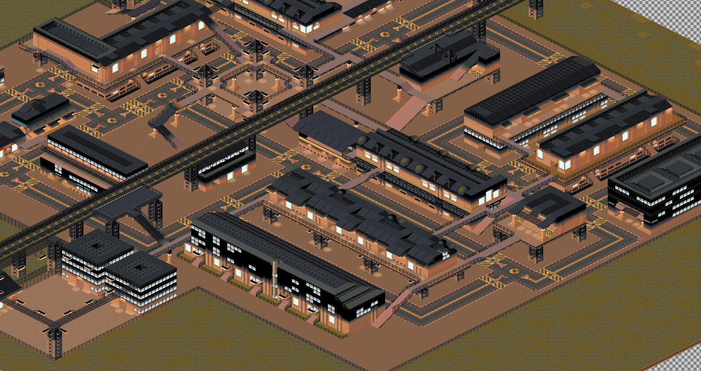
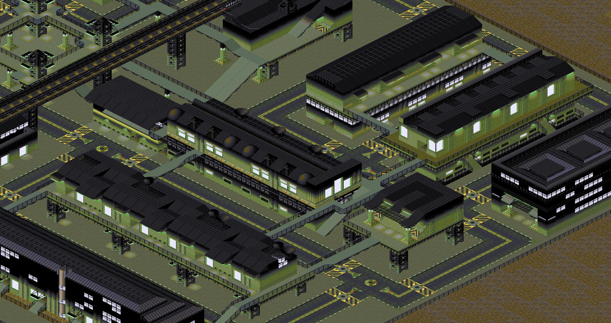

# Syndicate Map Viewer

## Purpose

Make a map viewer for **Syndicate**, one of the best games ever made.

## Assumptions

- This repository and the tools have been used only from a Linux system, with the [Good Old Games version](https://www.gog.com/game/syndicate) of Syndicate, which comes with all files in uppercase. I run  the game via [DOSBOX](https://www.dosbox.com/), but there's no real need of that to use the tools.
- Readable over optimized code.

## Setup

- run `yarn install`
- Install Wine (to run command line tools)
- From `tools/bullfrog_utils_rnc.zip`, you'll need the file `dernc.exe` to uncompress `.DAT` files.
- From your game installation (`\SYNDICAT\DATA` subfolder inside it), copy the relevant `.DAT` files to this repository's `data` subfolder:
  - `HBLK01.DAT`
  - `HPAL01.DAT` to `HPAL05.DAT` (or the amount of palette files you wish to use for maps)
  - `MAP01.DAT` to `MAP94.DAT` (or the amount of maps you wish to export)

### Decompressing files

Usage is like:
```
wine dernc.exe <filename1> <filename2> ...
```
Note: overrides the original with the uncompressed version. Game will work without problems with the uncompressed version but just so that you're aware. That's why for safety this project uses its own folder and you must copy data files there.

## Usage

### tile-exporter.js

This tool extracts all tiles from `HBLK01.DAT` file (put it into `data` folder and de-RNC it) into `png` files under the `tiles` subfolder. It extracts one version of each tile per palette.


### map-exporter.js

**WIP**

This tool exports a `MAPxx.DAT` map file into a `png` file under the `maps` subfolder.





## References

- This project would have never been possible without my initial inspiration, the great [FreeSynd file formats documentation](https://freesynd.sourceforge.io/ff.php), although some documentation is either outdated or incorrect.
- The [libsyndicate project](https://icculus.org/libsyndicate/) contains so many reverse engineered file formats that it is an invaluable source.

### Sprites Information

An schema I've drawn to understand how sprites entities and files combine:

```
┌───────────────┐
│               │
│  GameXX.DAT   │
│               │
└───────┬───────┘                 next frame
        │                          ┌───────┐
        │ anim & frame indexes     │       │
        │                          │       │
┌───────▼───────┐             ┌────▼───────┴───┐           ┌─────────────────┐       ┌──────────────────┐
│               │             │                │           │                 │       │                  │
│  Sprite Anim  ├────────────►│  Sprite Frame  ├──────────►│ Sprite Element  ├───────►  Sprite Element  │
│               │ frame index │                │  frames   │      TAB        │       │       data       │
└───────────────┘             └────────────────┘   list    └─────────────────┘       └──────────────────┘
```
