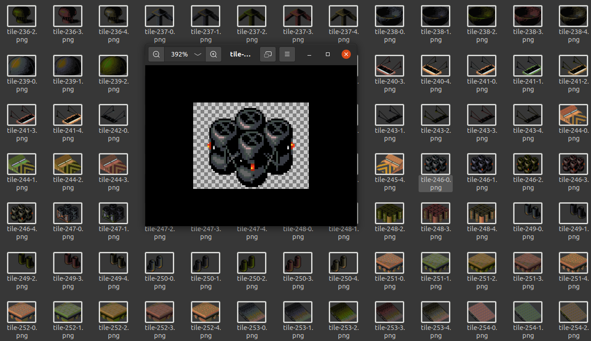

# Syndicate Map Viewer

## Purpose

Make a map viewer for **Syndicate**, one of the best games ever made.

## Assumptions

- This repository and the tools have been used only from a Linux system, with the [Good Old Games version](https://www.gog.com/game/syndicate) of Syndicate, which comes with all files in uppercase. Game is run via [DOSBOX](https://www.dosbox.com/).

## Setup

- run `yarn install`
- Install Wine (to run command line tools)
- From `tools/bullfrog_utils_rnc.zip`, you'll need the file `dernc.exe` to uncompress `.DAT` files.
- From your game installation, copy the relevant `.DAT` files to this repository's `data` subfolder:
  - HBLK01.DAT
  - HPAL01.DAT
  - HPAL02.DAT
  - HPAL03.DAT
  - HPAL04.DAT
  - HPAL05.DAT

### Decompressing files

Usage is like:
```
wine dernc.exe <filename1> <filename2> ...
```
Note: overrides the original with the uncompressed version. Game will work without problems with the uncompressed version but just so that you're aware. That's why for safety this project uses it's own folder and you must copy data files there.

## Usage

### tile-exporter.js

This tool extracts all tiles from `HBLK01.DAT` file (put it into `data` folder and de-RNC it) into `png` files under the `tiles` subfolder. It extracts one version of each tile per palette.



### map-exporter.js

**WIP**

This tool exports a `MAPxx.DAT` map file into a `png` file under the `maps` subfolder. 


## References

This project would have never been possible without the incredible [FreeSynd file formats documentation](https://freesynd.sourceforge.io/ff.php), but beware as some things are outdated or incorrect (some bit orderings, subtile dispositions, etc.).
